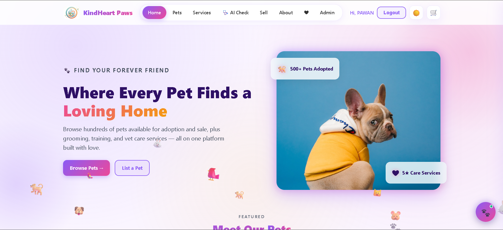
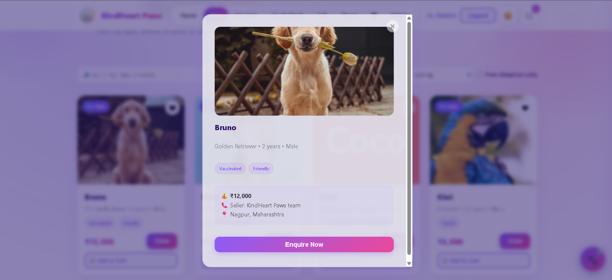
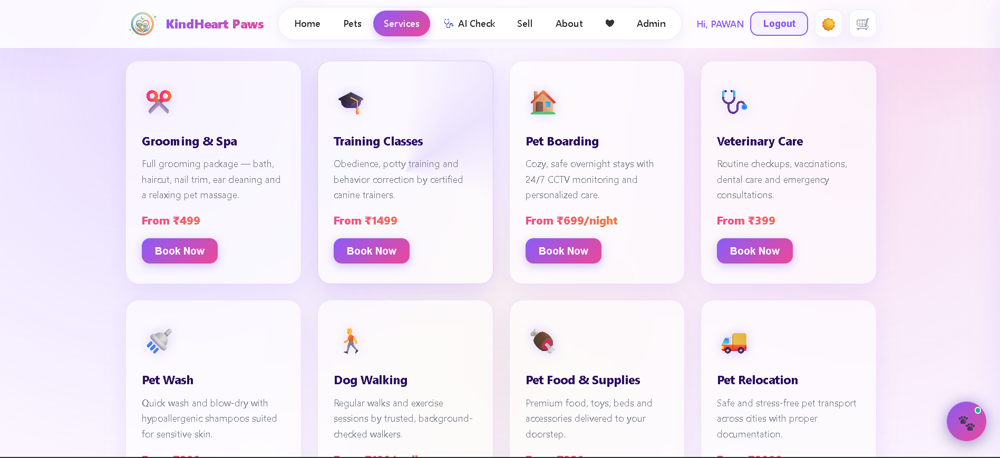
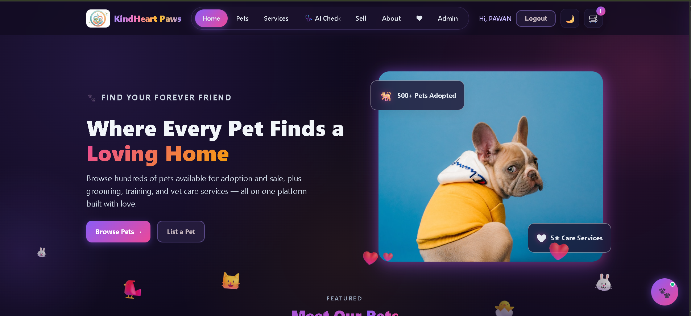
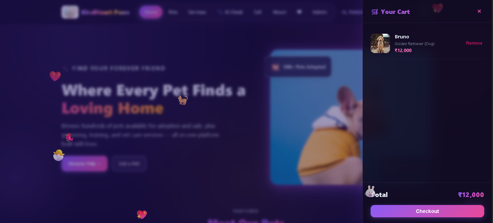
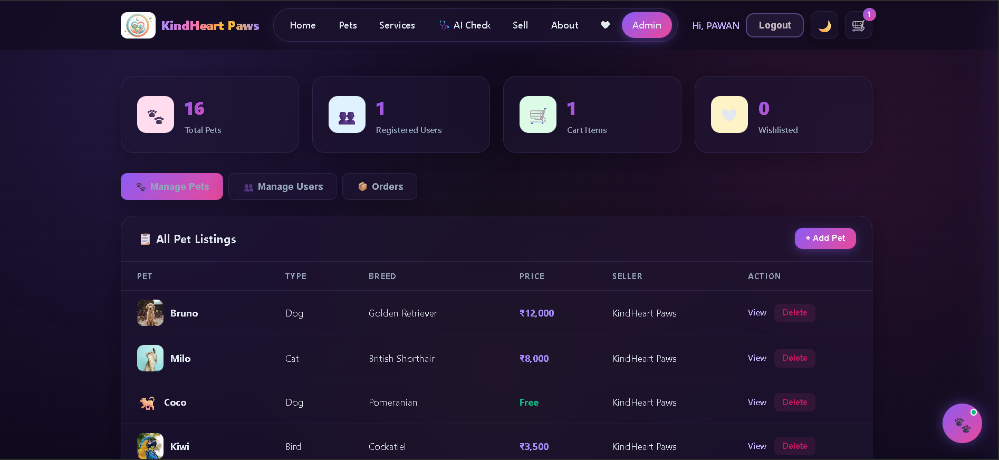
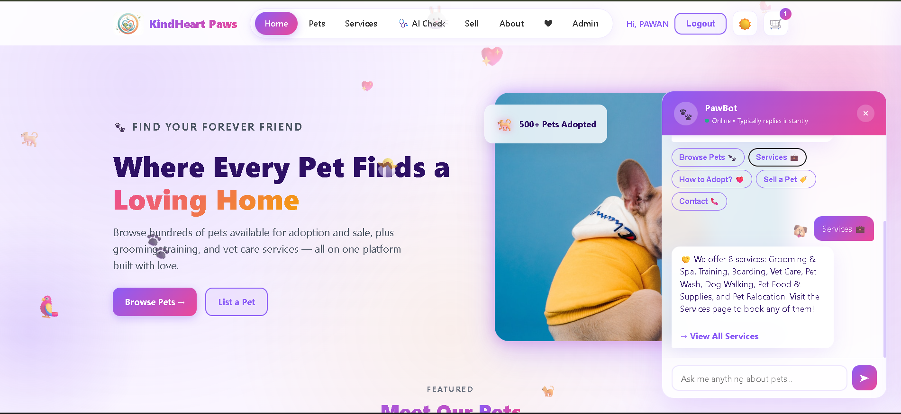

# 🐾 KindHeart Paws — Pet Adoption Platform

A full-featured pet adoption and care platform built with **HTML, CSS, and JavaScript**. Users can browse, adopt, and buy pets, book grooming & vet services, manage listings, and more — all with a beautiful responsive UI featuring dark mode, animations, and a built-in chatbot.

<p align="center">
  
</p>


# KindHeart Paws 🐾

---

## ✨ Features

### 🏠 Home Page
- Hero section with floating pet & love emoji animations
- Featured pets grid with staggered scroll-reveal animations
- Services teaser and "How It Works" section
- Fully responsive layout

### 🐾 Pets Page
- Browse all pets with live search by name or breed
- Filter by pet type (Dog, Cat, Bird, Fish, Rabbit)
- Sort by price (low to high / high to low) or name
- "Free Adoption only" filter toggle
- Click any pet card to view full details

### 🐶 Pet Detail Page
- Individual pet profile with large image
- Spec grid (Age, Gender, Type, Breed)
- Tags, description, and seller contact info
- Add to Cart, Enquire, and Wishlist buttons

### ✂️ Services Page
- 8 services: Grooming & Spa, Training, Boarding, Vet Care, Pet Wash, Dog Walking, Pet Food & Supplies, Pet Relocation
- Booking modal with pet type, date, and notes
- Services added directly to cart

### 🏷️ Sell Page
- List a pet for sale or adoption with a form
- Fields: name, type, breed, age, gender, price, tags, location, image URL, description
- View and manage your active listings
- Listed pets appear instantly on the Pets page

### ❤️ Wishlist Page
- Save favorite pets by clicking the heart icon
- View all saved pets in one place
- Add to cart directly from wishlist

### 🛒 Cart & Checkout
- Slide-in cart drawer with live total
- Add both pets and services to the same cart
- Full checkout flow with name, email, phone, address, and payment method
- Supports COD, UPI, and Card payment options
- Cart persists across pages

### 🔐 Authentication
- Login and Sign Up pages with form validation
- User accounts stored locally
- Protected actions: cart, checkout, pet listings, service booking

### 🌙 Dark Mode
- Toggle between light and dark themes
- Preference saved across all pages
- Full dark theme covering every component

### 🔐 Admin Dashboard
- Password-protected admin panel
- Stats: Total Pets, Registered Users, Cart Items, Wishlisted Pets
- Manage Pets tab: view, delete pet listings
- Manage Users tab: view all registered users with roles
- Orders tab: track active cart items and total value

### 🤖 KindBot Chatbot
- Floating chat widget on every page
- Smart keyword-based responses about pets, services, adoption, pricing, and navigation
- Typing indicator for realistic feel
- Quick reply chips for common questions
- Clickable link buttons in responses

### 🎨 UI/UX
- Blue & purple color theme with gradient accents
- Glow effects on buttons, cards, and inputs
- Scroll-reveal animations with staggered delays
- Pulsing badges, floating hero cards, shimmer button effects
- Animated gradient text on section headings
- Heartbeat animation on wishlist items
- Fully responsive (mobile, tablet, desktop)
- Reduced-motion accessibility support

---

## 🛠️ Tech Stack

| Technology | Usage |
|---|---|
| HTML5 | Page structure and semantic markup |
| CSS3 | Styling, animations, dark mode, responsive design |
| JavaScript (ES6) | App logic, cart, auth, chatbot, admin panel |
| LocalStorage API | Data persistence (users, pets, cart, wishlist) |
| IntersectionObserver | Scroll-reveal animations |

**No frameworks. No libraries. No dependencies. Pure HTML, CSS, and JS.**

---

## 📂 Project Structure

```
kindheart-paws/
├── index.html          # Home page
├── login.html          # Login / Sign up
├── pets.html           # Browse all pets
├── pet.html            # Individual pet detail page
├── services.html       # Services & booking
├── sell.html           # List a pet for sale/adoption
├── wishlist.html       # Saved favorite pets
├── admin.html          # Admin dashboard
├── about.html          # About page
├── css/
│   └── style.css       # All styling, animations, dark mode
├── js/
│   └── script.js       # All app logic, cart, auth, chatbot
└── images/             # Pet photos and assets (add your own)
```

---

## 🚀 Getting Started

### Option 1: Run locally
1. Download or clone this repository
2. Open `index.html` in any web browser
3. That's it — no server or installation needed

### Option 2: View live demo
Visit the GitHub Pages link (add your link here after deploying)

---

## 📸 Screenshots

### Home Page


### Pets Browse


### Pet Detail


### Services


### Dark Mode


### Cart & Checkout


### Admin Dashboard


### Chatbot


---

## 🔑 Admin Access

The admin dashboard is password-protected. Contact the repository owner for credentials.

---

## 📧 Contact

- **Email:** rathodpawan1224@gmail.com
- **Phone:** +91 9322120462
- **Location:** Nagpur, Maharashtra

---

## 📄 License

This project is open source and available under the MIT License.

---

## 👨‍💻 Author

**Pawan Rathod**

Built with HTML, CSS, and JavaScript.
